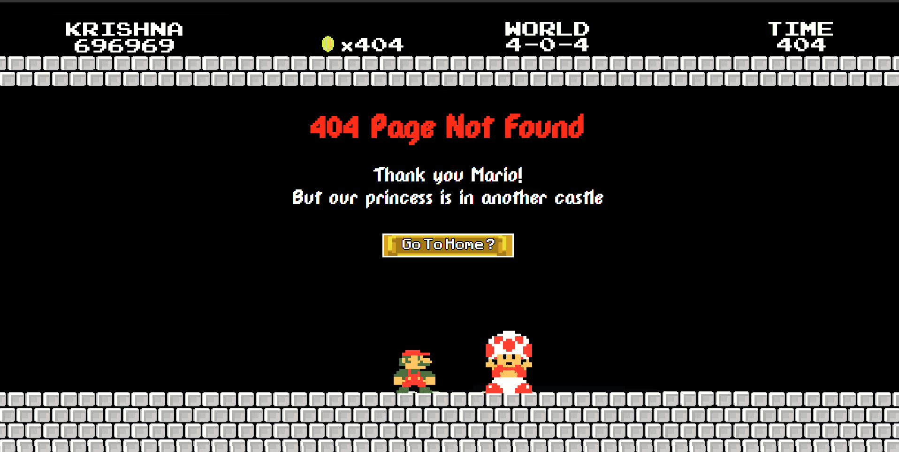
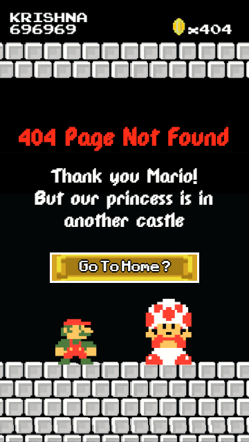
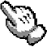
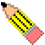
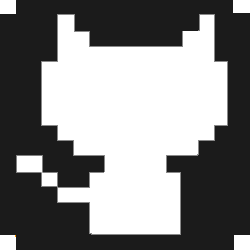
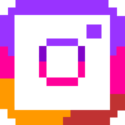
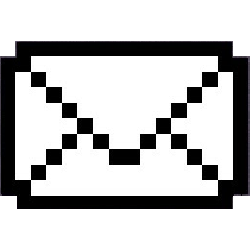

<h1 align="center">
   
  
   
</h1>

<h4 align="center">A Portfolio website completely designed from scratch by me!</h4>

  
  
  

This repository contains a 8-bit retro styled personal portfolio website that's created with HTML and CSS. It's light-weight and totally responsive. The site is static, minimalistic and comes production ready. To line up your portfolio website, merely fork the repo and edit its content. Alternatively,  you can also edit designs, colours, and scripts fairly easily. The site was developed as modular as possible to aid easy shifting around designs and its contents.

**For beginners, Fork it and replace the body with the desired content**

## Features

-   Fully responsive
-   Optimized for mobiles and all browsers
-   A Super Mario Bros inspired [404 Page](http://thekrishna.in/notfound.html)

| Desktop       | Mobile |
| ------------- | ----------- |
|  |  |

-   Custom Design Cursor icons

| Default Cursor       | Cursor Hover      | Cursor Edit       |
| ------------- | ----------- | ------------- |
|    |  |   |

-   Custom Design Social Icons (LinkedIn, Instagram, GitHub, Mail)

| GithHub       | Instagram      | LinkedIn       | Mail       |
| ------------- | ----------- | ------------- | ----------- |
|    |  |   |  |

-   Compressed all visual (treats) element for much faster loading times

## License

The **Pixel Portfolio** is licensed under the terms of the [MIT license](LICENSE) and is available for free.

## Links

-   [Website](https://thekrishna.in/v1/index.html)
-   [404 Page](https://thekrishna.in/notfound.html)
-   [Documentation](https://github.com/bearlike/Pixel-Portfolio-Webite/blob/master/docs/documentation.md)
-   [Issue tracker](https://github.com/bearlike/Pixel-Portfolio-Webite/issues)
-   [Source code](https://github.com/bearlike/Pixel-Portfolio-Webite)

  Made with ❤️ by <a href="https://github.com/bearlike">Krishna Alagiri</a>

